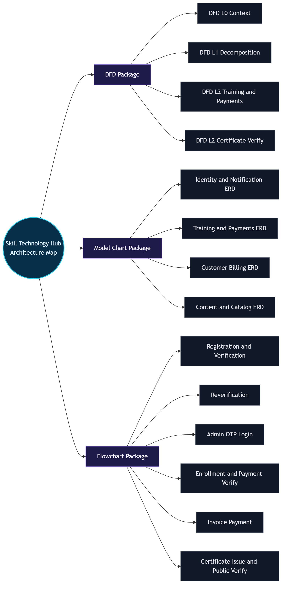

# Skill Technology Hub - Architecture Pack

Generated on: 2026-02-23

## Core Sources

- `doc/DFD.md`
- `doc/MODEL_CHARTS.md`
- `doc/FLOWCHARTS.md`
- `doc/ARCHITECTURE_WIREMAP.md`

## Visual Wiremap

- Interactive wiremap page: `doc/architecture_wiremap.html`
- Mermaid wiremap source: `doc/ARCHITECTURE_WIREMAP.md`
- Wiremap SVG: `doc/diagrams/svg/15_architecture_wiremap_master_wiremap.svg`
- Wiremap PNG: `doc/diagrams/png/15_architecture_wiremap_master_wiremap.png`

## Exported Diagram Assets

### DFD Exports

- `doc/diagrams/svg/01_dfd_dfd_level_0_context.svg`
- `doc/diagrams/png/01_dfd_dfd_level_0_context.png`
- `doc/diagrams/svg/02_dfd_dfd_level_1_process_decomposition.svg`
- `doc/diagrams/png/02_dfd_dfd_level_1_process_decomposition.png`
- `doc/diagrams/svg/03_dfd_dfd_level_2_training_and_payment_subsystem.svg`
- `doc/diagrams/png/03_dfd_dfd_level_2_training_and_payment_subsystem.png`
- `doc/diagrams/svg/04_dfd_dfd_level_2_certificate_verification_subsystem.svg`
- `doc/diagrams/png/04_dfd_dfd_level_2_certificate_verification_subsystem.png`

### Model Chart Exports

- `doc/diagrams/svg/05_model_charts_1_identity_access_notification_models.svg`
- `doc/diagrams/png/05_model_charts_1_identity_access_notification_models.png`
- `doc/diagrams/svg/06_model_charts_2_training_enrollment_payment_certificate_models.svg`
- `doc/diagrams/png/06_model_charts_2_training_enrollment_payment_certificate_models.png`
- `doc/diagrams/svg/07_model_charts_3_customer_service_billing_review_models.svg`
- `doc/diagrams/png/07_model_charts_3_customer_service_billing_review_models.png`
- `doc/diagrams/svg/08_model_charts_4_content_and_public_catalog_models.svg`
- `doc/diagrams/png/08_model_charts_4_content_and_public_catalog_models.png`

### Flowchart Exports

- `doc/diagrams/svg/09_flowcharts_1_registration_and_email_verification_flow.svg`
- `doc/diagrams/png/09_flowcharts_1_registration_and_email_verification_flow.png`
- `doc/diagrams/svg/10_flowcharts_2_reverification_flow_profile_or_resend.svg`
- `doc/diagrams/png/10_flowcharts_2_reverification_flow_profile_or_resend.png`
- `doc/diagrams/svg/11_flowcharts_3_admin_login_otp_flow.svg`
- `doc/diagrams/png/11_flowcharts_3_admin_login_otp_flow.png`
- `doc/diagrams/svg/12_flowcharts_4_trainee_enrollment_and_payment_verification_flow.svg`
- `doc/diagrams/png/12_flowcharts_4_trainee_enrollment_and_payment_verification_flow.png`
- `doc/diagrams/svg/13_flowcharts_5_invoice_payment_flow_customer.svg`
- `doc/diagrams/png/13_flowcharts_5_invoice_payment_flow_customer.png`
- `doc/diagrams/svg/14_flowcharts_6_certificate_issue_and_public_verification_flow.svg`
- `doc/diagrams/png/14_flowcharts_6_certificate_issue_and_public_verification_flow.png`

## Diagram Source Files

Mermaid source files used for exports:

- `doc/diagrams/src/01_dfd_dfd_level_0_context.mmd`
- `doc/diagrams/src/02_dfd_dfd_level_1_process_decomposition.mmd`
- `doc/diagrams/src/03_dfd_dfd_level_2_training_and_payment_subsystem.mmd`
- `doc/diagrams/src/04_dfd_dfd_level_2_certificate_verification_subsystem.mmd`
- `doc/diagrams/src/05_model_charts_1_identity_access_notification_models.mmd`
- `doc/diagrams/src/06_model_charts_2_training_enrollment_payment_certificate_models.mmd`
- `doc/diagrams/src/07_model_charts_3_customer_service_billing_review_models.mmd`
- `doc/diagrams/src/08_model_charts_4_content_and_public_catalog_models.mmd`
- `doc/diagrams/src/09_flowcharts_1_registration_and_email_verification_flow.mmd`
- `doc/diagrams/src/10_flowcharts_2_reverification_flow_profile_or_resend.mmd`
- `doc/diagrams/src/11_flowcharts_3_admin_login_otp_flow.mmd`
- `doc/diagrams/src/12_flowcharts_4_trainee_enrollment_and_payment_verification_flow.mmd`
- `doc/diagrams/src/13_flowcharts_5_invoice_payment_flow_customer.mmd`
- `doc/diagrams/src/14_flowcharts_6_certificate_issue_and_public_verification_flow.mmd`
- `doc/diagrams/src/15_architecture_wiremap_master_wiremap.mmd`

