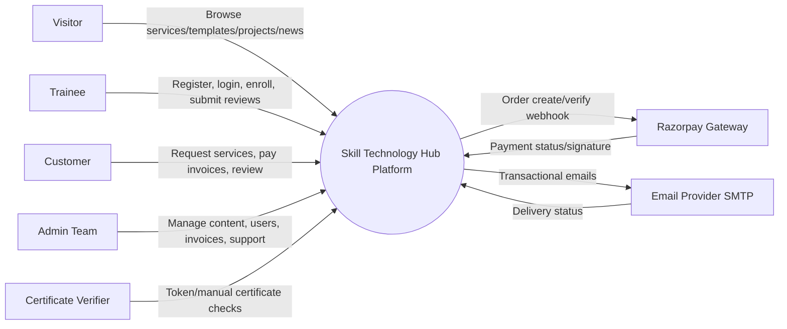
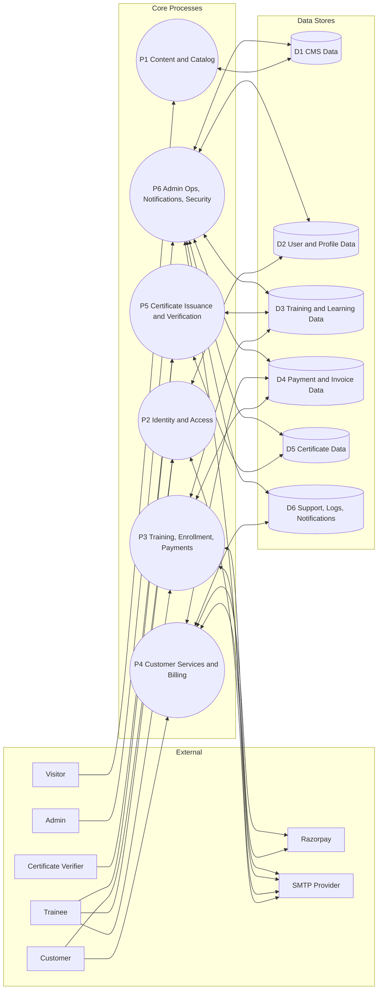
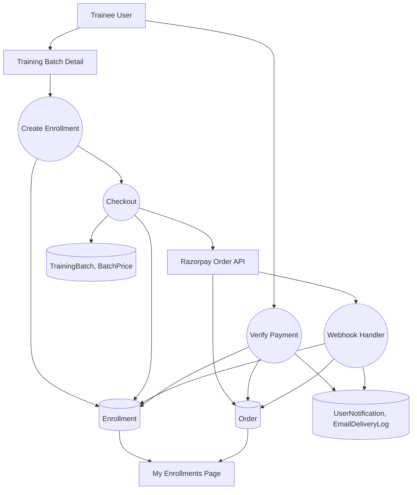
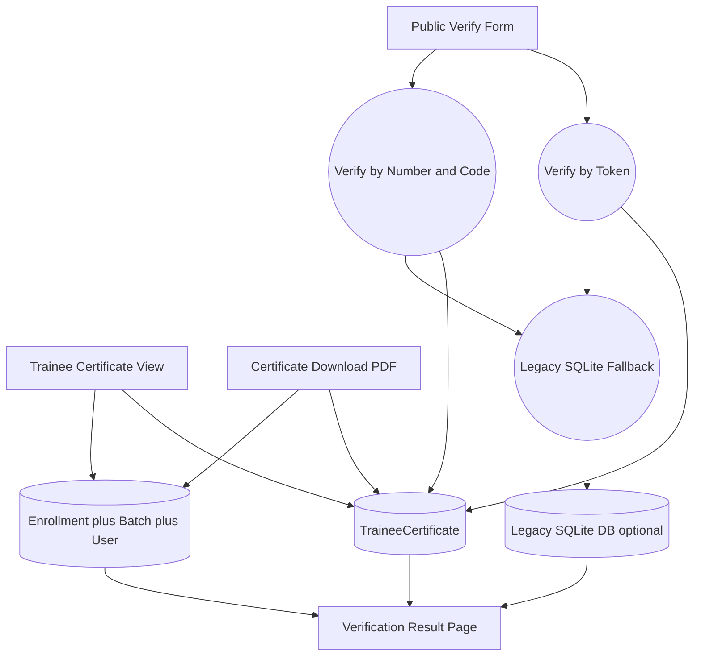

# Skill Technology Hub - Data Flow Diagrams (DFD)

Source snapshot: `skill_technology_hub` (Django project)
Generated on: 2026-02-23

## DFD Level 0 (Context)

## DFD Level 1 (Process Decomposition)

## DFD Level 2 - Training and Payment Subsystem

## DFD Level 2 - Certificate Verification Subsystem

## Data Store Mapping

| Store | Main Tables/Models |
|---|---|
| D1 CMS Data | `Page`, `TrustedCompany`, `Post`, `PostCategory`, `TemplateItem`, `TemplateCategory`, `Project`, `ProjectCategory`, `PortfolioItem`, `TeamMember`, `ContactMessage` |
| D2 User and Profile Data | `auth_user`, `UserProfile`, `Role`, `NotificationPreference` |
| D3 Training and Learning Data | `TrainingBatch`, `BatchPrice`, `Enrollment`, `TraineeSession`, `TraineeAttendance`, `TraineeAssignment`, `TraineeAssignmentSubmission`, `TraineeBookmark`, trainee reviews |
| D4 Payment and Invoice Data | `Order`, `Invoice`, `InvoicePayment`, appointment payment flags |
| D5 Certificate Data | `TraineeCertificate` with verification token/code logic |
| D6 Support, Logs, Notifications | `TraineeSupportTicket`, `UserNotification`, `EmailDeliveryLog`, `AdminActivityLog`, `WebsiteErrorLog`, `AdminIPBlock` |

