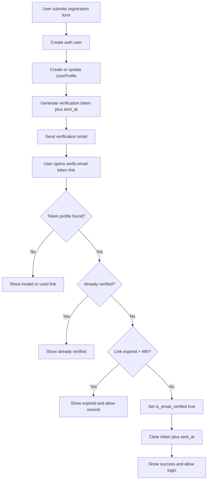
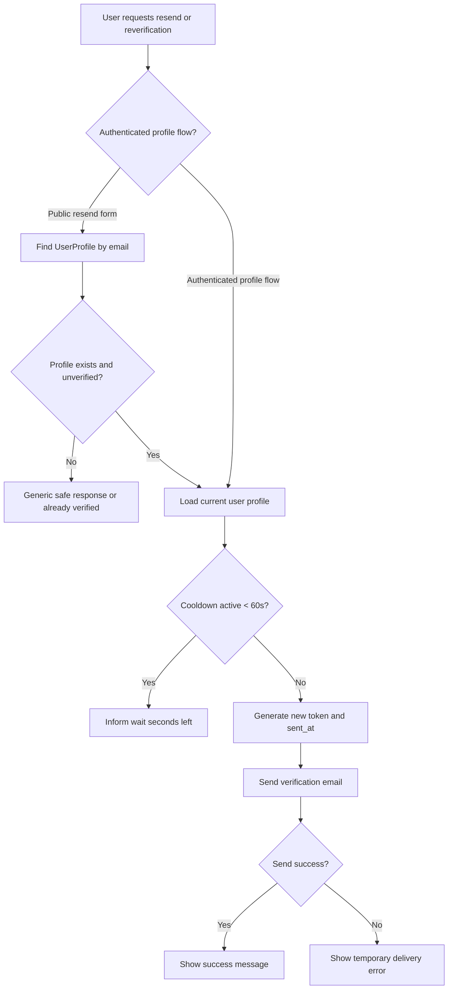
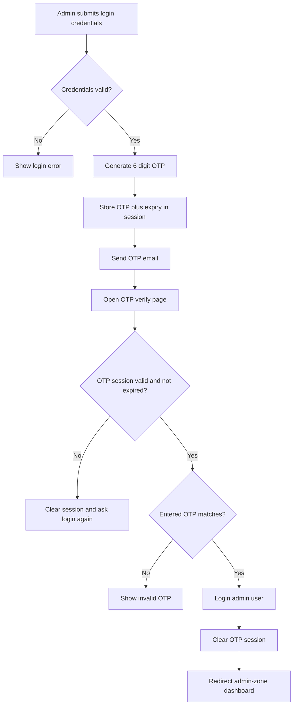
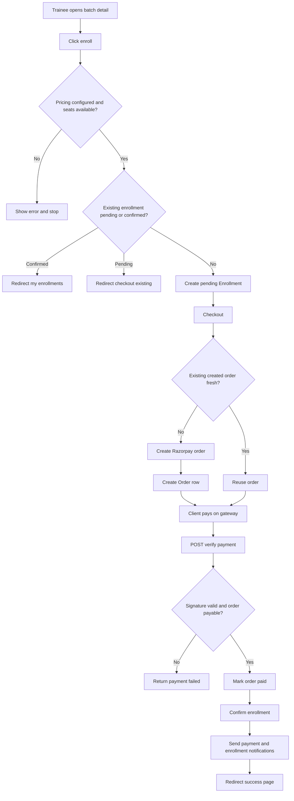
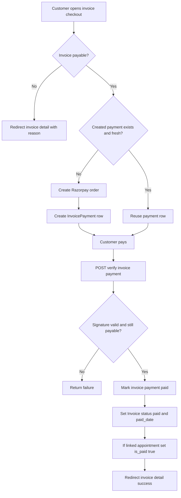
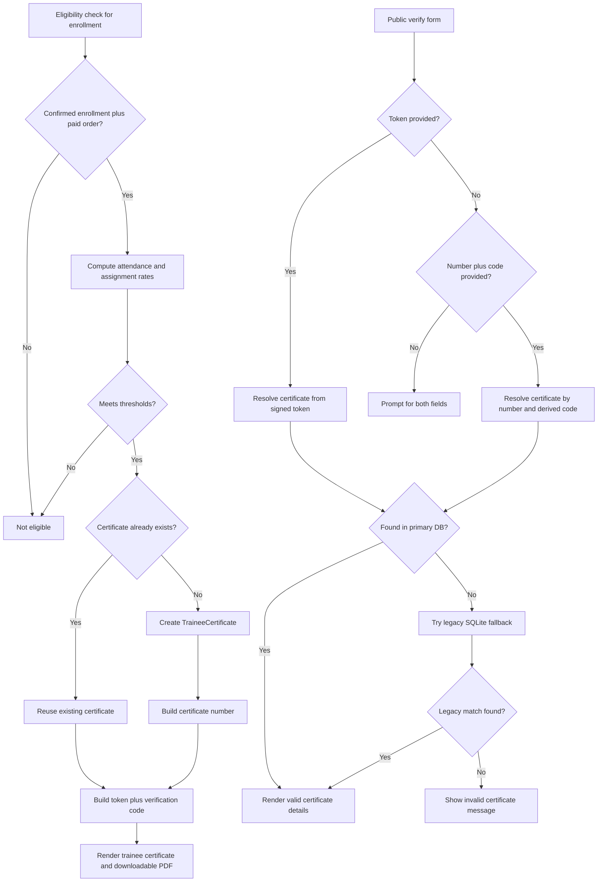

# Skill Technology Hub - Process Flowcharts

Source snapshot: `skill_technology_hub` (Django project)
Generated on: 2026-02-23

## 1) Registration and Email Verification Flow

## 2) Reverification Flow (Profile or Resend)

## 3) Admin Login OTP Flow

## 4) Trainee Enrollment and Payment Verification Flow

## 5) Invoice Payment Flow (Customer)

## 6) Certificate Issue and Public Verification Flow

