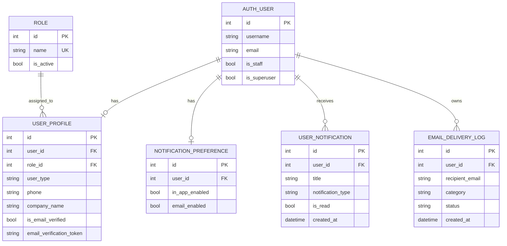
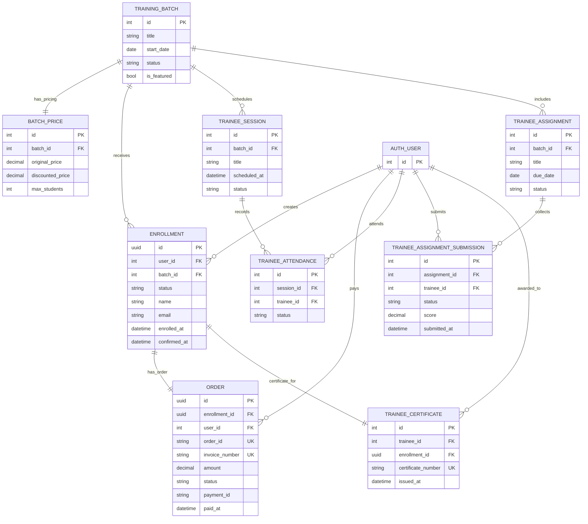
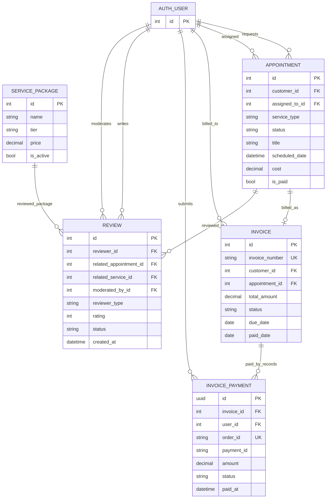
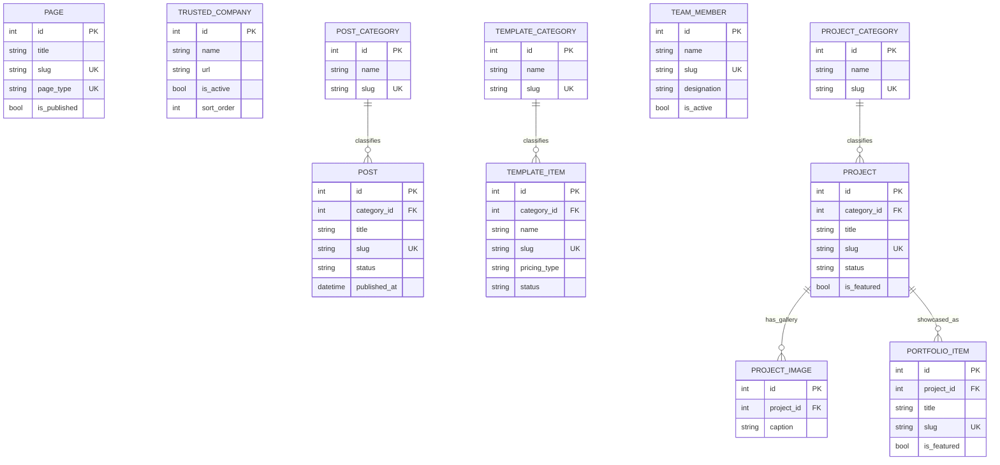

# Skill Technology Hub - Model Charts (ERD)

Source snapshot: `skill_technology_hub` (Django project)
Generated on: 2026-02-23

## 1) Identity, Access, Notification Models

## 2) Training, Enrollment, Payment, Certificate Models

## 3) Customer Service, Billing, Review Models

## 4) Content and Public Catalog Models

